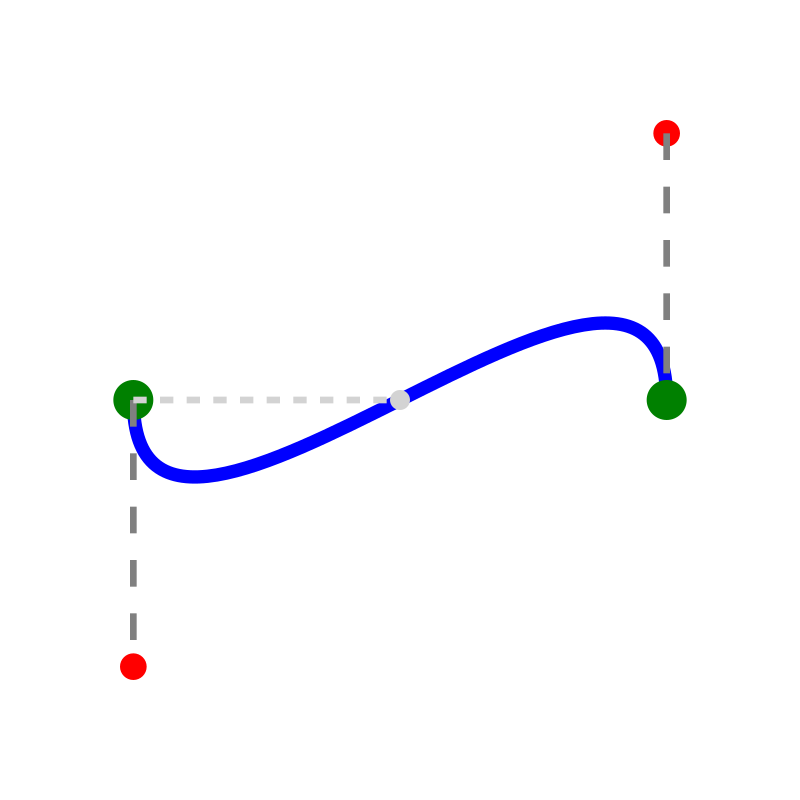

# Bezier Path

A constrained cubic Bezier S-curve with perpendicular control handles.



## How It Works

This example demonstrates a cubic Bezier curve where the control handles are constrained to be perpendicular to the baseline. This creates a smooth S-curve that enters and exits horizontally.

## Key Constraints Used

- **cubic**: Defines a cubic Bezier curve with 4 control points
- **perpendicular**: Forces the control handles to be perpendicular to the reference line
- **distance**: Controls the length of control handles (curve tension)
- **fixed**: Anchors the start point and reference

## Parameters

| Parameter | Default | Description |
|-----------|---------|-------------|
| `handle_length` | 40 mm | Length of control handles (affects curve tension) |
| `curve_width` | 80 mm | Horizontal distance between start and end points |

## Entity: cubic

The `cubic` entity defines a cubic Bezier curve:

```json
{
  "type": "cubic",
  "id": "s_curve",
  "control_points": ["start", "ctrl1", "ctrl2", "end"]
}
```

- **control_points**: Array of 4 point IDs [P0, P1, P2, P3]
- P0: Start point
- P1: First control point (influences curve near start)
- P2: Second control point (influences curve near end)
- P3: End point

## Adjusting Curve Shape

- **Increase handle_length**: Makes the curve more pronounced (tighter S)
- **Decrease handle_length**: Makes the curve gentler
- Change control point positions to create different curve shapes

## Known Limitation

The `cubic` entity is solved correctly but does not render in SVG export yet (see issue #45). The SVG in this example has the curve path added manually for visualization.

## Applications

- Smooth path design
- Animation curves (easing functions)
- Font design (glyph outlines)
- CAD/CAM toolpaths
